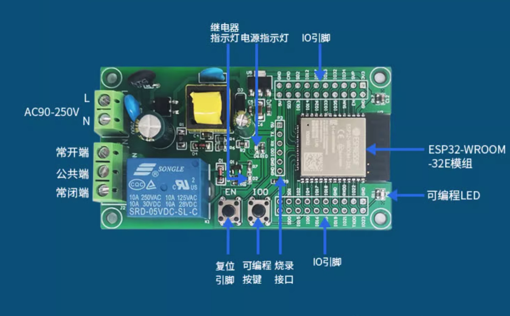

# ESP32 HomeKit Fan Controller

本项目基于 ESP-IDF，支持 Apple HomeKit 协议的风扇（继电器）控制，支持 BLE/SoftAP 配网，支持物理按键一键恢复出厂。

## 功能特性
- HomeKit 配网与控制（支持 iOS Home App）
- 继电器控制风扇通断（GPIO16）
- 状态指示 LED（GPIO23）
- 按钮（GPIO0）长按清除配网信息并重启
- 配网成功后可通过 Home App 控制风扇，LED 会闪烁两下提示，继电器同步动作

## 硬件连接
| 功能   | GPIO | 说明         |
| ------ | ---- | ------------ |
| LED    | 23   | 状态指示灯   |
| 继电器 | 16   | 风扇开关控制 |
| 按钮   | 0    | 配网/恢复出厂|

### 主板实物图



## 快速上手
1. **克隆本仓库**
2. **配置 ESP-IDF 环境**
3. **编译 & 烧录**
   ```sh
   idf.py build
   idf.py -p <PORT> flash
   ```
4. **首次上电/长按按钮**，进入配网模式
5. **BLE 配网需下载官方配网 App：**
   - Android：[ESP BLE Provisioning App (GitHub)](https://github.com/espressif/esp-idf-provisioning-android)
   - iOS：[ESP SoftAP Provisioning (App Store)](https://apps.apple.com/in/app/esp-softap-provisioning/id1474040630)
   按提示完成配网
6. **使用 iOS Home App 添加配件**，输入配对码 `111-11-111`
7. **配网成功后**，可通过 Home App 控制风扇，LED 会闪烁两下，继电器同步动作

## 新增功能说明

### 1. 网页端控制
- 浏览器访问 `http://<设备IP>:8080/` 可直接控制风扇开关，状态自动刷新。
- 网页控制、API 控制、HomeKit 控制均会同步风扇状态。
- 倒计时功能：可在网页端设置风扇定时关闭，支持自定义倒计时时长，倒计时结束后风扇自动关闭，页面会显示剩余时间。

### 2. 恢复出厂设置（蓝灯提示）
- 长按开发板上的按键（GPIO0）3 秒以上，蓝色 LED 会常亮。
- 常亮松开按键即可重新配网。

### 3. API 说明
- `GET /api/status`  获取风扇当前状态，返回：
  ```json
  { "status": 0/1, "timer_left": 秒数 }
  ```
- `GET /api/on`     打开风扇，返回：
  ```json
  { "result": true, "status": 1 }
  ```
- `GET /api/off`    关闭风扇，返回：
  ```json
  { "result": true, "status": 0 }
  ```
- `GET /api/timer_off?seconds=xx`  设置倒计时关闭风扇，xx为秒数，返回：
  ```json
  { "result": true, "timer": xx }
  ```
- `GET /api/cancel_timer`  取消当前倒计时，返回：
  ```json
  { "result": true }
  ```
  或
  ```json
  { "result": false, "error": "no timer running" }
  ```
- 所有 API 支持 CORS，可跨域调用。


## 常见问题
- **如何恢复出厂/重新配网？**
  长按按钮（GPIO0）3 秒，NVS 擦除并自动重启，进入配网模式。
- **无法配网/连接不上？**
  在 ESP BLE Prov app 中关闭加密（Encrypted Commuication）。

## 版权声明
本项目基于 ESP-IDF & Espressif HomeKit SDK，代码仅供学习和个人项目使用。
